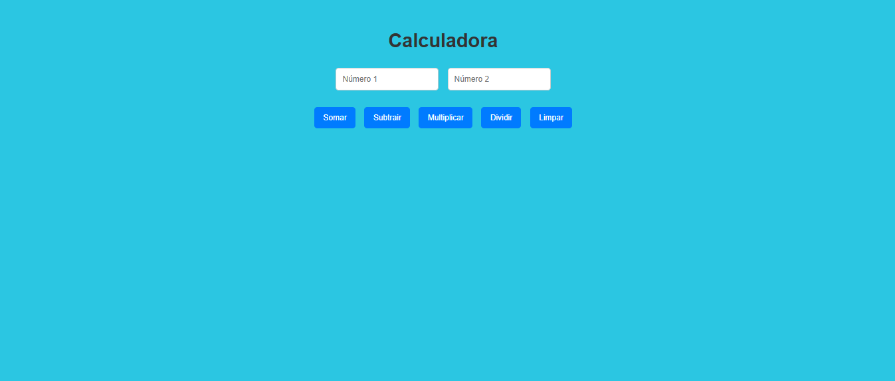

# Calculadora Simples

Projeto desenvolvido com HTML, CSS e JavaScript.

## 🚀 Funcionalidades
- Soma
- Subtração
- Multiplicação
- Divisão

## 💻 Objetivo
Praticar lógica de programação e manipulação de DOM.
## 📸 Preview

